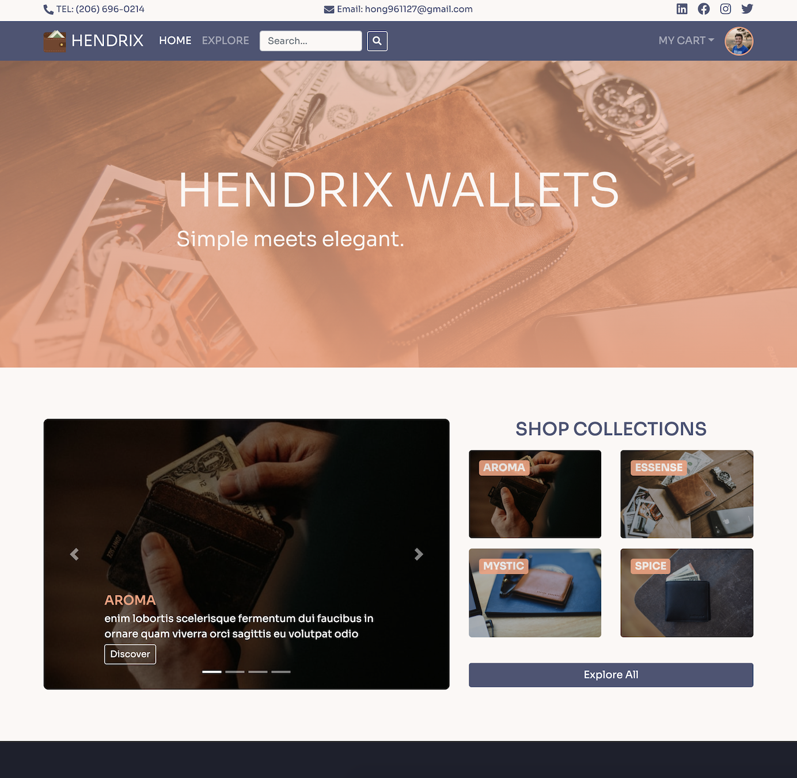
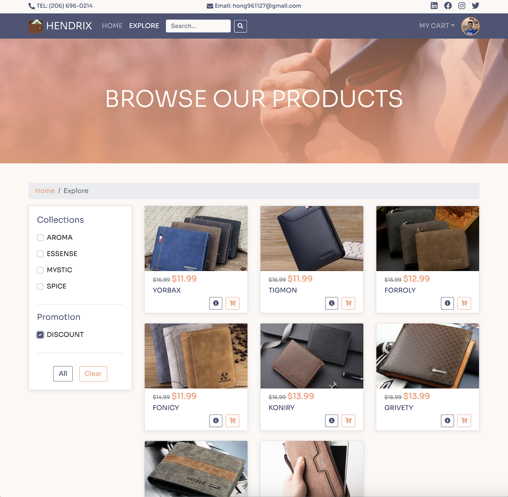
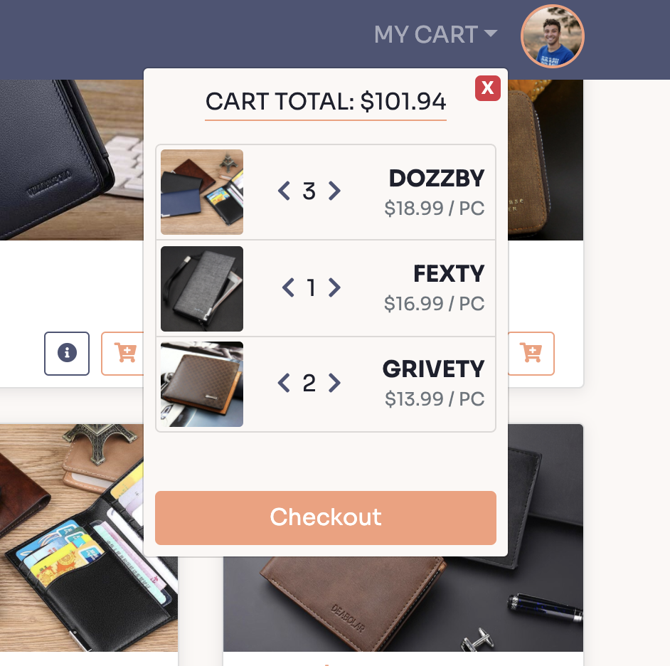
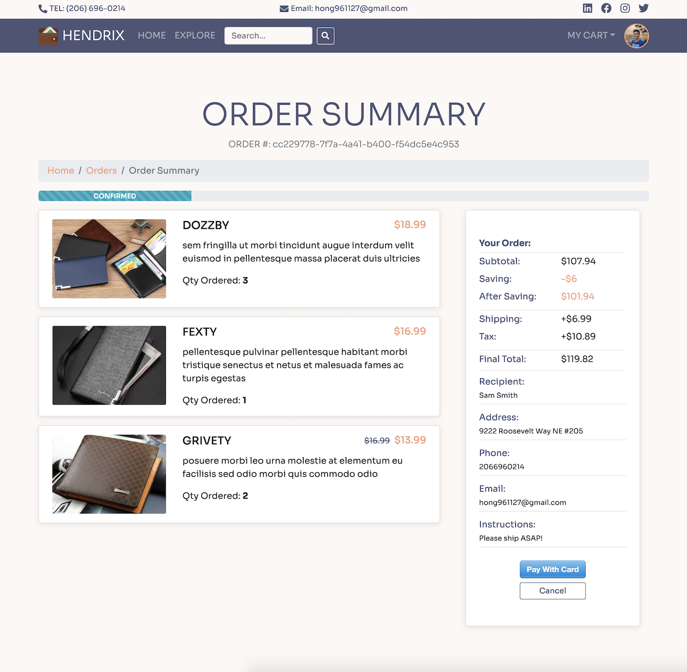
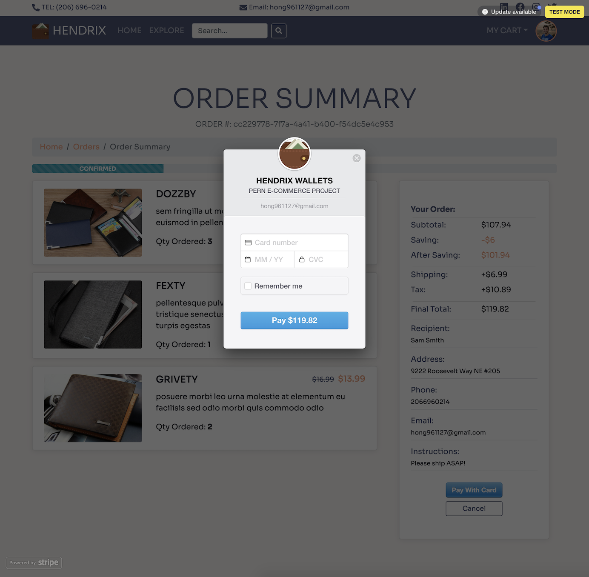
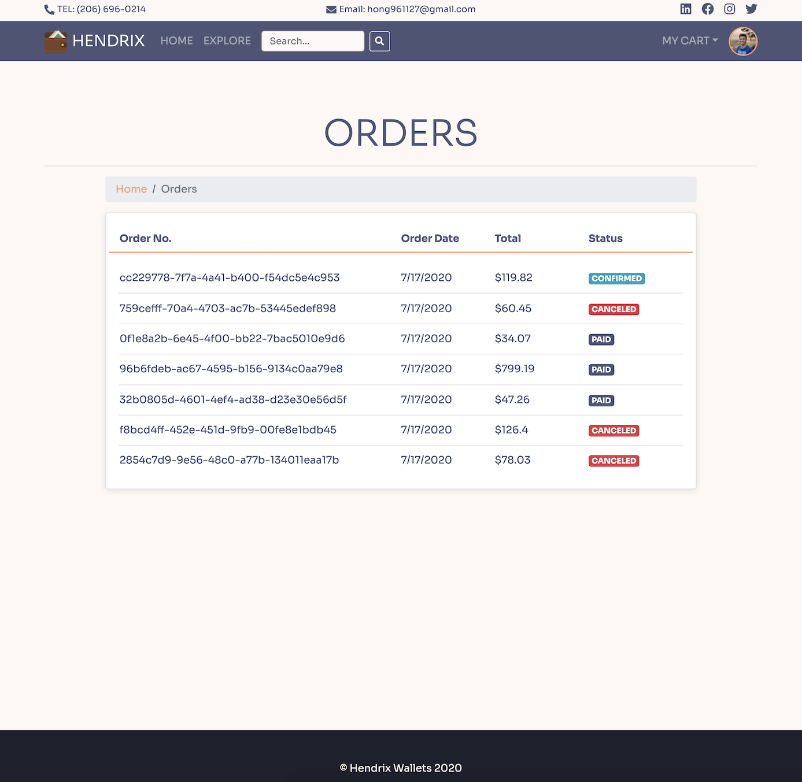
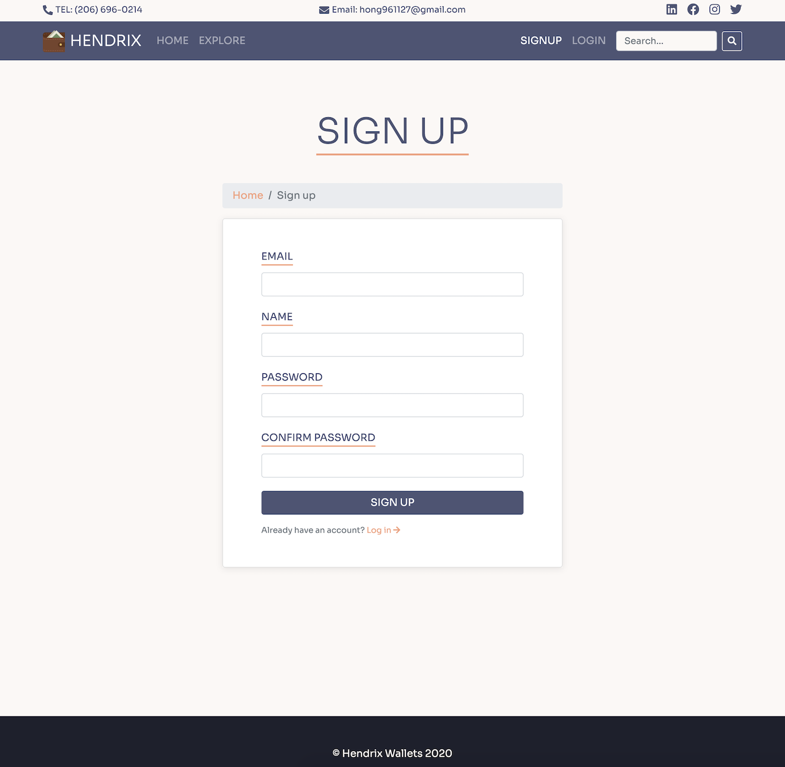

# PERN FRULL-STACK E-COMMERCE PLATFORM

### Main technolodges: Node/Express, PostgreSQL, React, Redux, Sass, Bootstrap, Stripe

**Customer facing MVP is complete**
*Currently working on admin facing CMS to manage products and orders*

---

**Current Features:**
- Customer authentication: login / signup
- Update customer profile info / profile image
- Browse / filter / search products
- Add products to cart / Delete items from cart
- Checkout and create an order
- Pay for an order with card
- Cancel an order
- Moniter order status

---

## SHOWCASE:

### HOME PAGE

### ITEMS PAGE

### CART COMPONENT

### CHECKOUT PAGE

### ORDER SUMMARY PAGE

### STRIPE INTEGRATION

### CUSTOMER ORDER LIST

### CUSTOMER PROFILE

### CUSTOMER SIGNUP

