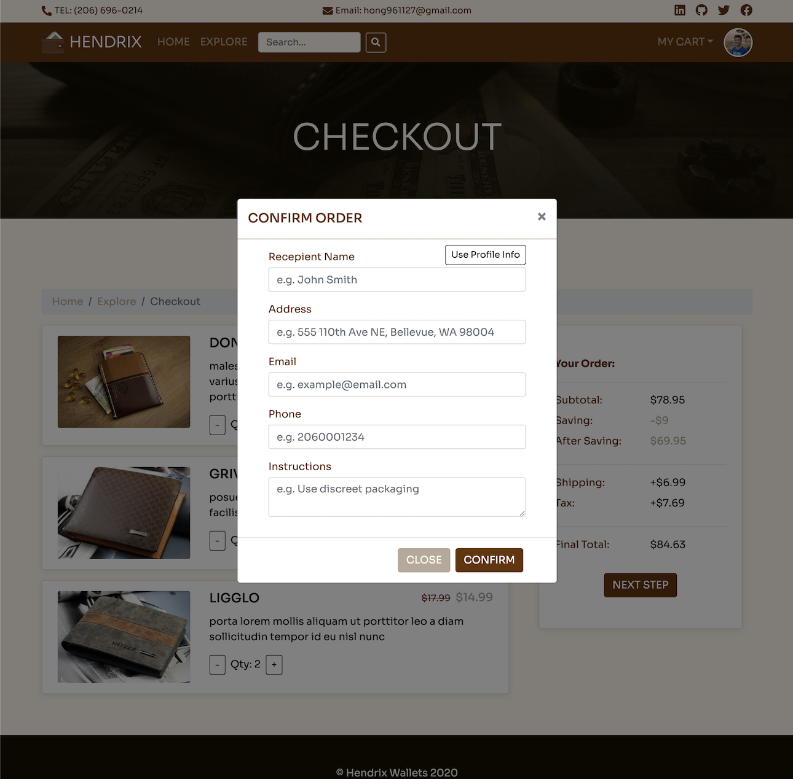
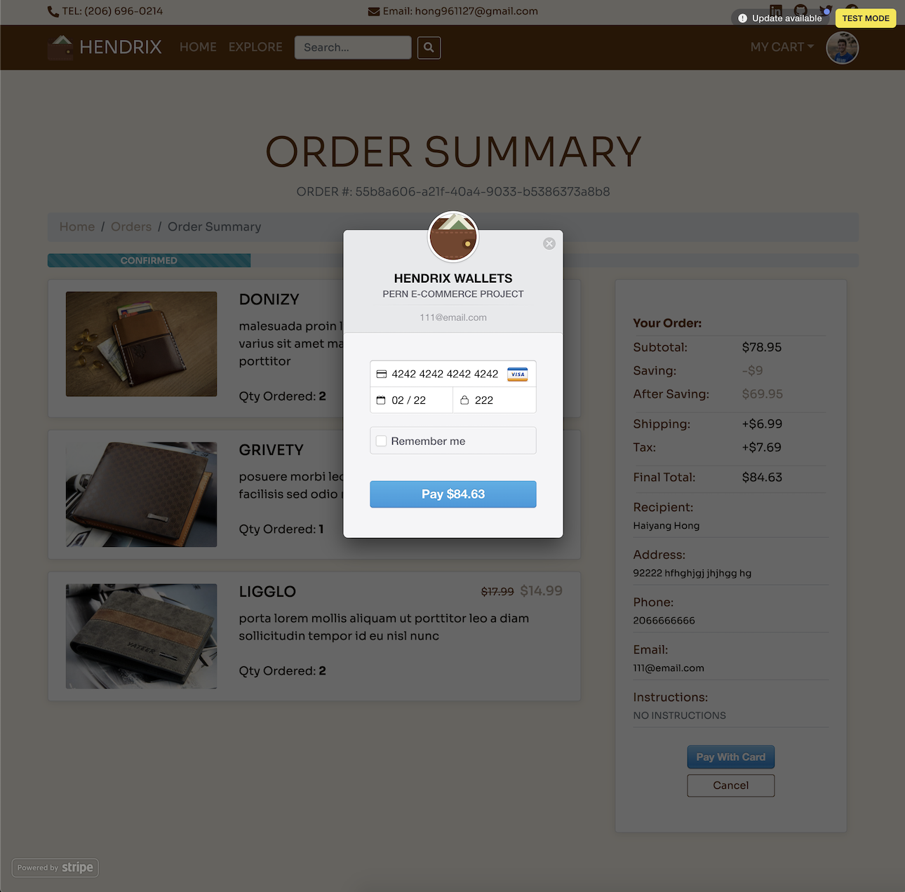
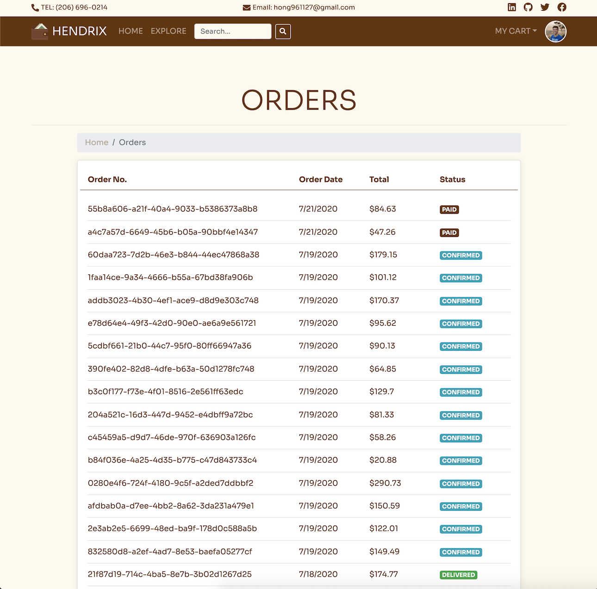
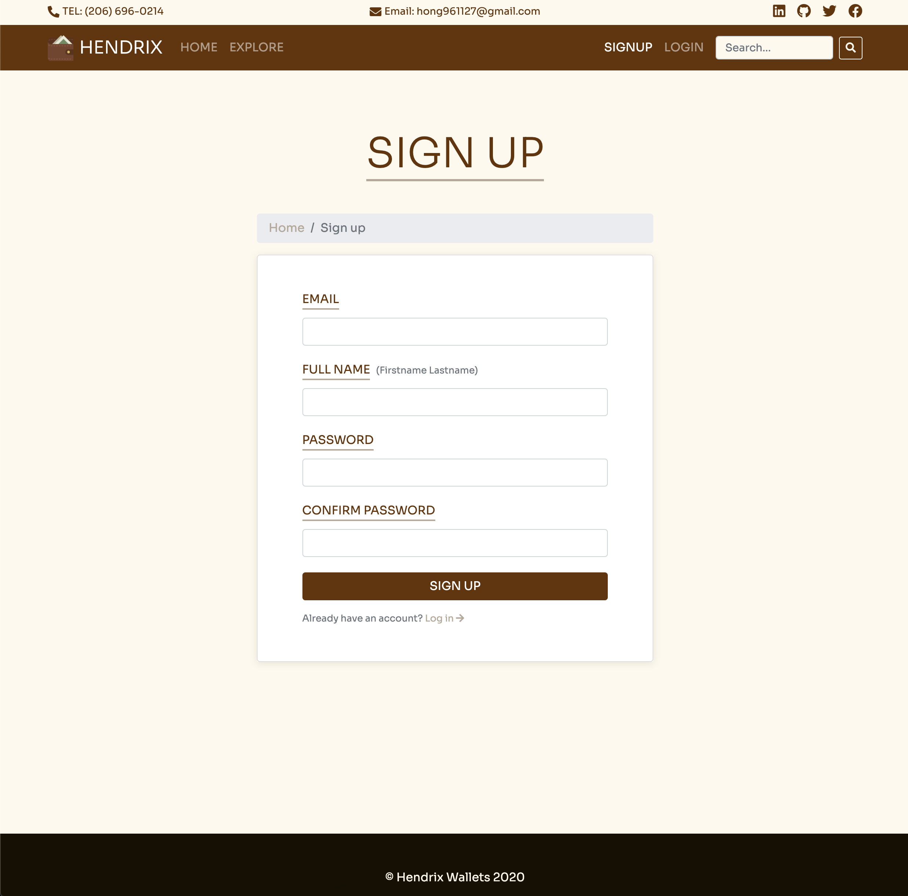
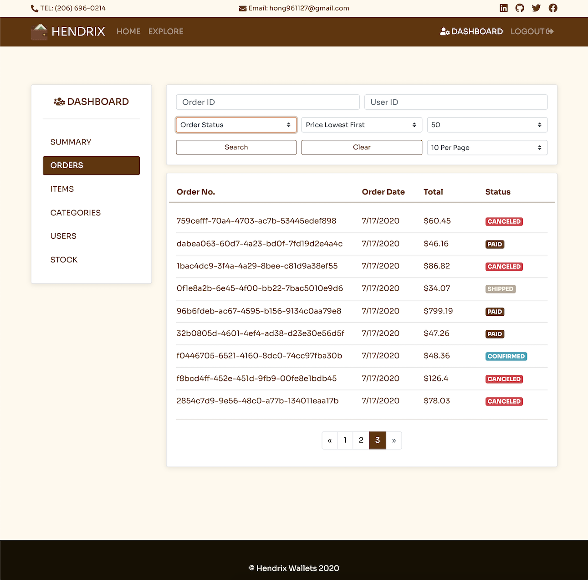
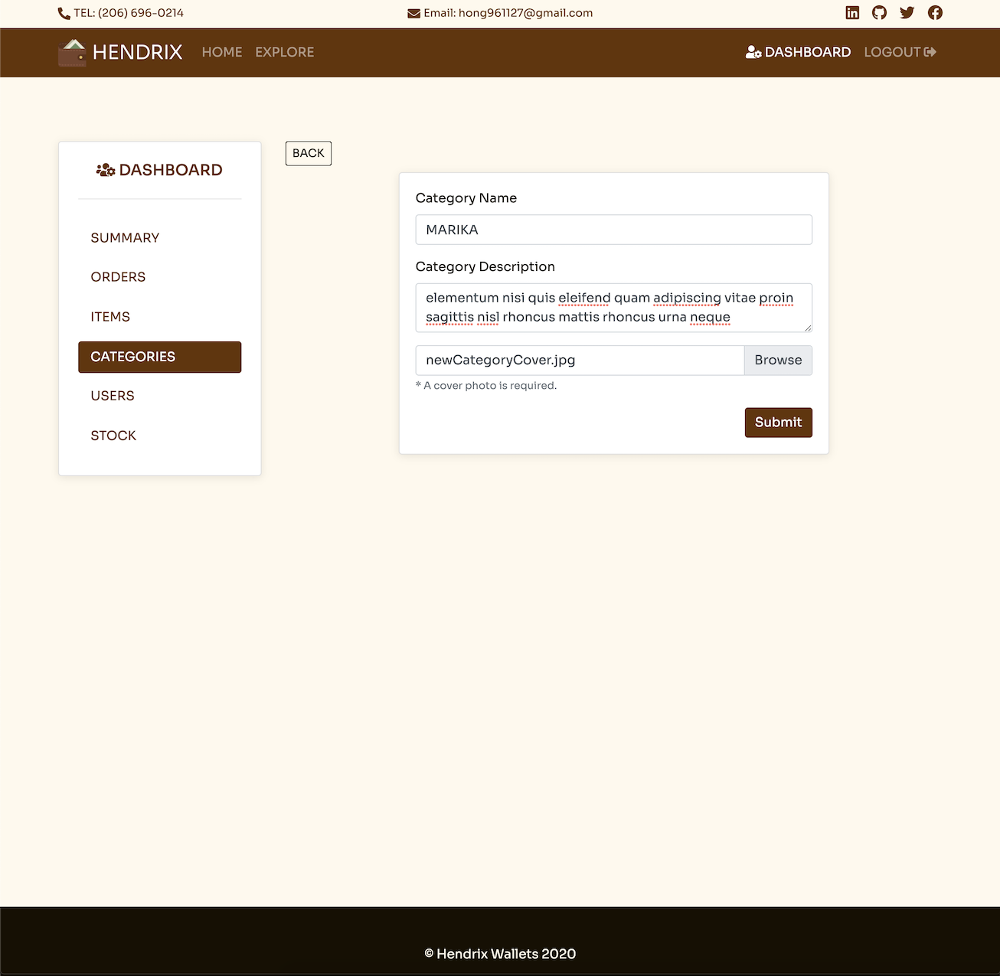
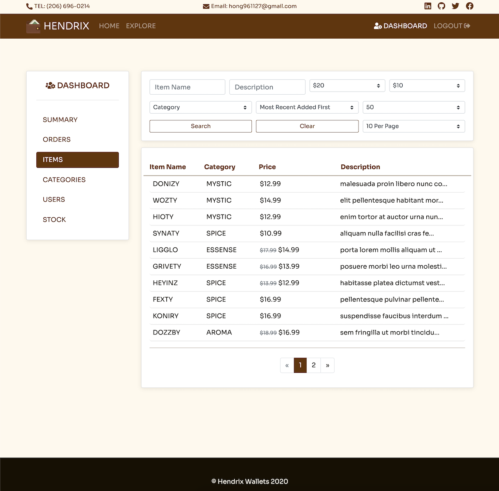
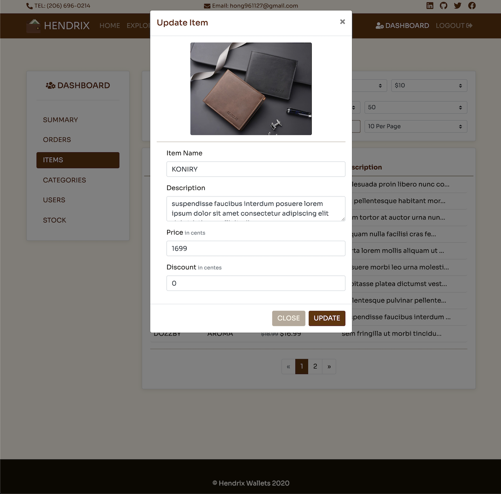

# Hendrix Wallets

### An e-commerce platform for selling wallets.

#### Built with React, Sass, Bootstrap, Node.js, PostgreSQL, Socket.IO, Stripe, AWS(S3).

## Implemented User stories:

#### As a customers, I want to...

- Browse / Filter / Search through all wallets for sale.
- Log in or sign up with an email.
- Update my profile info and profile image.
- Add wallets in to my shopping cart / delete wallets from my shopping cart.
- Place an order.
- Pay for the order with credit card.
- Cancel an order.
- Moniter order status.

#### As an admin, I want to...

- Manage the platform from an admin dashboard.
- Browse / Filter / Search through customers' orders
- Change an order's status to shipped, or delivered.
- Update wallets' information and price/discount
- Create new wallets for a collection
- Create a new collection.

## Live Demo

[Deployed app on Heroku](https://hendrix-wallets.herokuapp.com/)

## Screenshot Previews

#### LANDING PAGE


#### PRODUCTS PAGE


#### CHECKOUT PAGE



#### STRIPE INTEGRATION



#### CUSTOMER ORDER LIST



#### CUSTOMER PROFILE


#### CUSTOMER SIGNUP



#### ADMIN ORDER MANAGEMENT



#### ADMIN COLLECTION MANAGEMENT


#### ADMIN COLLECTION MANAGEMENT - ADD COLLECTION



#### ADMIN PRODUCT MANAGEMENT



#### ADMIN PRODUCT MANAGEMENT - UPDATE ITEMS



## Installation

Use NPM:

```bash
npm i # install nodejs express app dependencies
cd client && npm i # install React app dependencies
```

## Usage

```bash
npm run dev # starts up the nodejs server on port 5000, react app on port 3000
```

## Contributing

Pull requests are welcome. For major changes, please open an issue first to discuss what you would like to change.

## License

[MIT](https://choosealicense.com/licenses/mit/)
